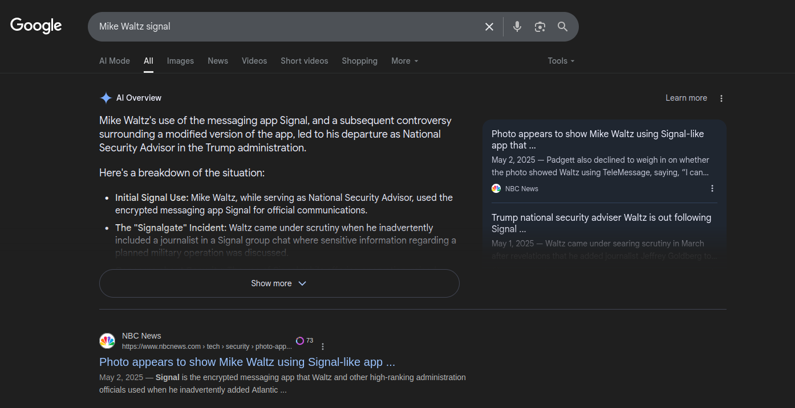
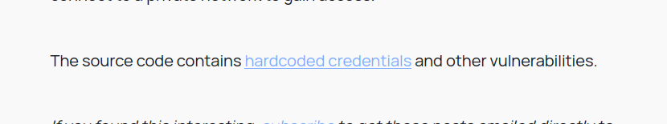
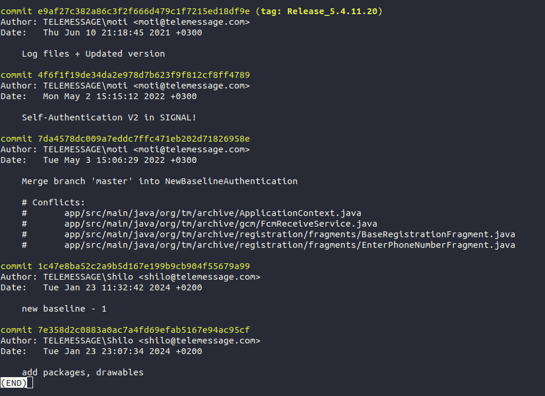
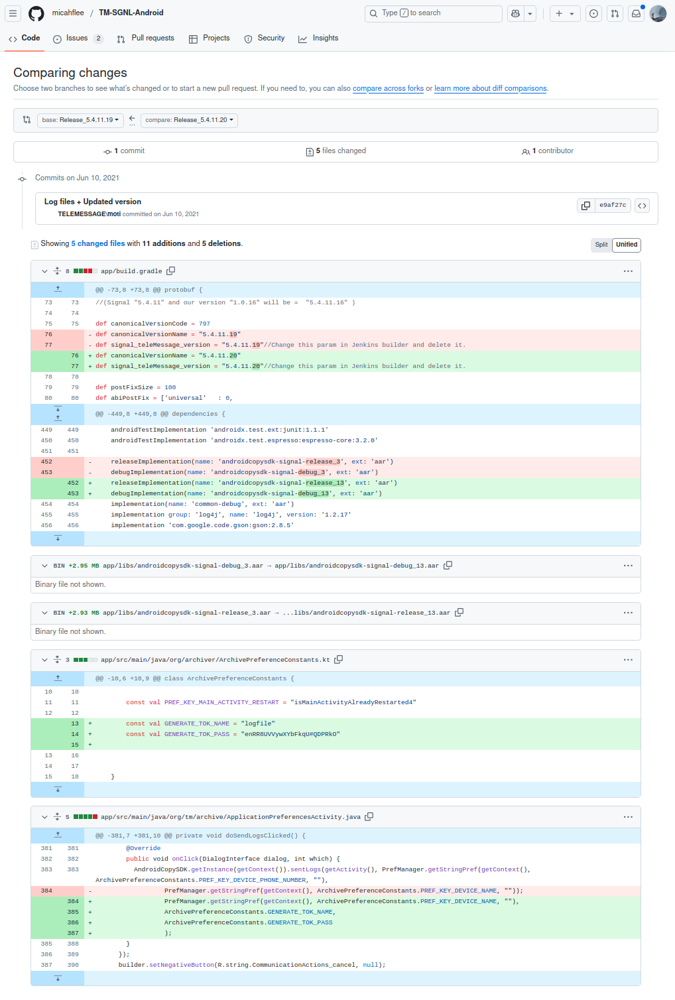

# Sending Mixed Messages

Based on the challenge text, users can start googling around for fake signal apps, Mike Waltz, etc.

Eventually, they can find the image of fake singal mentioned.



That gives the name "TeleMessage" (a ton of other websites show this too).

### Once you have "TeleMessage".

There are several ways to work your way to a technical report from the guy who researched the source code, one way is through reddit.


All roads should lead here: https://micahflee.com/heres-the-source-code-for-the-unofficial-signal-app-used-by-trump-officials/
As well as his GitHub upload: https://github.com/micahflee/TM-SGNL-Android

(the IOS version is also linked, but it doesn't have a `.git` so it's not going to be useful for the other questions besides the first one).

### Question 1

The first quetsion is about what credential is hard coded in the code. The article (and others) all point to a token for a log file.



Which reveals the first answer at https://github.com/micahflee/TM-SGNL-Android/blob/libs/app/src/tm/java/org/archiver/ArchiveConstants.kt on line 46.

```
const val GENERATE_TOK_PASS = "enRR8UVVywXYbFkqU#QDPRkO"
```

First answer is: `enRR8UVVywXYbFkqU#QDPRkO`.

Note: There's also a test password on that page. I couldn't find any indication that the other password is used anywhere, but I specified in the challenge text that the credential is for a "log file" to make it more clear this is the one I'm looking for.

### Question 2

The second question is for the email of the contributor who added the token. The best way to derive this is to do the following:
1. Clone the repository `git clone git@github.com:micahflee/TM-SGNL-Android.git`
2. Use `git log` and search for the credential `git log -S'enRR8UVVywXYbFkqU#QDPRkO' --reverse`
3. Observe the first known commit of the credential.




Based on this, we can see that the first commit with the credential was on `Jun 10 2021` by `moti@telemessage.com`.

The answer to part 2 is: `moti@telemessage.com`.

Note: If done correctly, this also reveals the answer to question 3. However, I anticipate people will find that email in other ways and may not have the correct commit. This will come to light in question 3.

### Question 3

The third question is for the release where the credential first showed up. The best way to derive this is by following the process in step 2, and observing the release tag in the commit (`e9af27c382a86c3f2f666d479c1f7215ed18df9e`) where the credential first appeared. The release tag is `Release_5.4.11.20`.

You can validate this by looking at the release changes on GitHub, where you see the credential added (https://github.com/micahflee/TM-SGNL-Android/compare/Release_5.4.11.19...Release_5.4.11.20)



Third answer is: `Release_5.4.11.20`

### Flag

Once you enter all 3 answers correctly, you should get the flag:

```
flag{96143e18131e48f4c937719992b742d7}
```

**Big note on this one:** The credential shows up in two places in the GitHub repository. The first file location is `app/src/tm/java/org/archiver/ArchiveConstants.kt`, and the second location is `app/src/main/java/org/archiver/ArchivePreferenceConstants.kt`.

People trying to solve this challenge can follow the process just looking at the first file location (`app/src/tm/java/org/archiver/ArchiveConstants.kt`) and get the first two questions correct, but they will likely get stuck on the third part and get the release wrong. This is because the hard-coded credential shows up in the *other* file location (`app/src/main/java/org/archiver/ArchivePreferenceConstants.kt`) for several commits / releases, then it gets moved to a new file at some point where it stays for the rest of the commit history.

The best / most efficient way to determine this is to use the `git log` command and search specifically for the string. By providing a check on the webpage to validate part 1 is correct (i.e., users know they're looking for the right credential), I'm hoping to lead people in that direction. But, I anticipate there will be *incorrect* answers in the range of May, 2022 and `Release_5.31.6.0`, because that's the first time the hard-coded credential shows up in the second file path.

A final note... question 3 could be brute forced if someone really wanted to. Not really in the spirit of the game though.